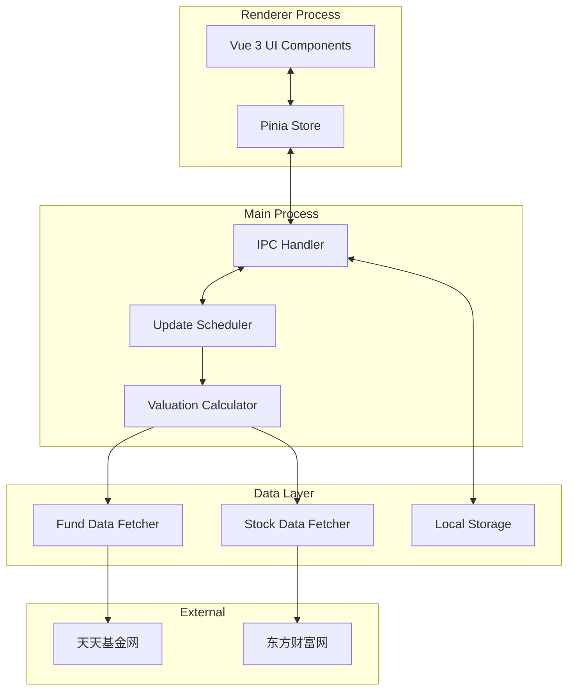
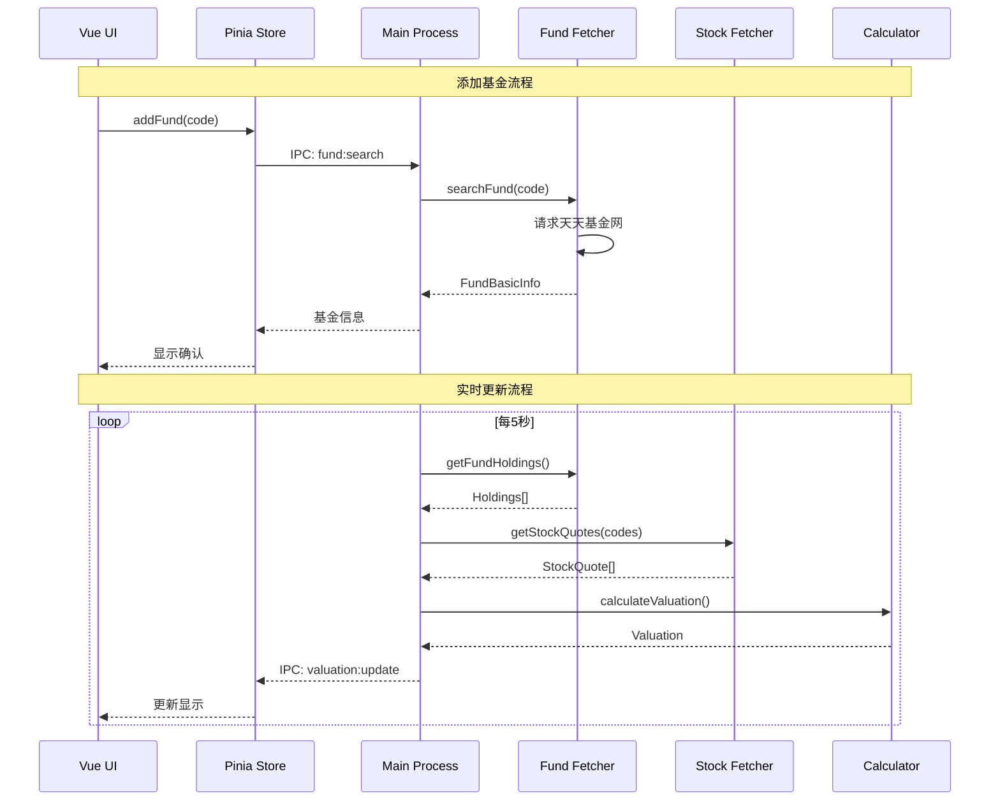

# Design Document: 基金自选客户端

## Overview

基金自选客户端采用 Electron + Vue 3 架构，实现跨平台桌面应用。系统分为三层：渲染进程（UI层）、主进程（业务逻辑层）、数据层（抓取与存储）。核心功能是通过抓取天天基金网的基金持仓数据和东方财富网的股票实时行情，自行计算基金估值并实时更新展示。

## Architecture



### 技术选型

| 层级       | 技术                    | 说明                       |
| ---------- | ----------------------- | -------------------------- |
| 跨平台框架 | Electron 28+            | 支持 Windows/Mac，成熟稳定 |
| 前端框架   | Vue 3 + TypeScript      | 用户熟悉，类型安全         |
| UI 组件库  | Element Plus            | 丰富的组件，适合桌面应用   |
| 状态管理   | Pinia                   | Vue 3 官方推荐，简洁易用   |
| 构建工具   | Vite + electron-builder | 快速开发，跨平台打包       |
| HTTP 请求  | Axios                   | 主进程中发起请求避免跨域   |
| 本地存储   | electron-store          | 简单的 JSON 文件存储       |

## Components and Interfaces

### 1. 渲染进程组件

```typescript
// src/renderer/types/fund.ts
interface Fund {
  code: string // 基金代码，如 "000001"
  name: string // 基金名称
  netValue: number // 最新净值
  netValueDate: string // 净值日期
  estimatedValue: number // 估算净值
  estimatedChange: number // 估算涨跌幅 (百分比)
  updateTime: string // 估值更新时间
  holdings: Holding[] // 前十大持仓
}

interface Holding {
  stockCode: string // 股票代码
  stockName: string // 股票名称
  ratio: number // 持仓占比 (百分比)
  change: number // 当日涨跌幅 (百分比)
  price: number // 当前价格
}

interface WatchlistState {
  funds: Fund[]
  loading: boolean
  error: string | null
  lastUpdateTime: string | null
}
```

### 2. 主进程服务接口

```typescript
// src/main/services/types.ts
interface IFundService {
  searchFund(code: string): Promise<FundBasicInfo | null>
  getFundDetail(code: string): Promise<FundDetail>
}

interface IStockService {
  getStockQuotes(codes: string[]): Promise<StockQuote[]>
}

interface IValuationService {
  calculateValuation(fund: FundDetail, quotes: StockQuote[]): Valuation
}

interface IStorageService {
  getWatchlist(): Fund[]
  saveWatchlist(funds: Fund[]): void
}
```

### 3. IPC 通信接口

```typescript
// src/shared/ipc-channels.ts
const IPC_CHANNELS = {
  // 基金操作
  FUND_SEARCH: 'fund:search',
  FUND_ADD: 'fund:add',
  FUND_REMOVE: 'fund:remove',

  // 数据更新
  VALUATION_UPDATE: 'valuation:update',
  VALUATION_REFRESH: 'valuation:refresh',

  // 自选列表
  WATCHLIST_GET: 'watchlist:get',
  WATCHLIST_SAVE: 'watchlist:save'
} as const
```

## Data Models

### 数据流转图



### 存储数据结构

```typescript
// electron-store 存储格式
interface StorageSchema {
  watchlist: {
    funds: StoredFund[]
    version: number
  }
  settings: {
    updateInterval: number // 更新间隔，默认 5000ms
    theme: 'light' | 'dark'
  }
}

interface StoredFund {
  code: string
  name: string
  netValue: number
  netValueDate: string
  holdings: StoredHolding[]
  addedAt: string // ISO 日期字符串
}

interface StoredHolding {
  stockCode: string
  stockName: string
  ratio: number
}
```

## Correctness Properties

_A property is a characteristic or behavior that should hold true across all valid executions of a system—essentially, a formal statement about what the system should do. Properties serve as the bridge between human-readable specifications and machine-verifiable correctness guarantees._

### Property 1: 估值计算正确性

_For any_ 基金持仓列表（包含股票代码和持仓占比）和对应的股票涨跌幅数据，估值计算器计算的基金涨跌幅应等于 Σ(股票涨跌幅 × 持仓占比)。

**Validates: Requirements 2.2, 7.1, 7.2**

### Property 2: 估值净值计算正确性

_For any_ 昨日净值和估值涨跌幅，计算的估值净值应等于 昨日净值 × (1 + 估值涨跌幅)。

**Validates: Requirements 7.3**

### Property 3: 自选列表添加不变性

_For any_ 自选列表和有效基金，添加该基金后列表长度增加1，且列表包含该基金。

**Validates: Requirements 1.3**

### Property 4: 自选列表去重

_For any_ 已包含某基金的自选列表，再次添加相同基金代码时，列表应保持不变。

**Validates: Requirements 1.4**

### Property 5: 自选列表删除不变性

_For any_ 包含某基金的自选列表，删除该基金后列表长度减少1，且列表不再包含该基金。

**Validates: Requirements 3.5**

### Property 6: 持久化 Round-Trip

_For any_ 自选列表，保存到本地存储后再加载，应得到等价的列表数据。

**Validates: Requirements 4.1, 4.2**

### Property 7: 涨跌幅排序正确性

_For any_ 包含多个基金的自选列表，按涨跌幅排序后，列表应按涨跌幅降序排列。

**Validates: Requirements 3.6**

### Property 8: 涨跌颜色映射

_For any_ 涨跌幅数值，正数应映射为红色（上涨），负数应映射为绿色（下跌），零应映射为灰色。

**Validates: Requirements 2.4**

### Property 9: 基金信息展示完整性

_For any_ 基金数据，渲染的列表项应包含基金代码、名称、估值、涨跌幅和更新时间。

**Validates: Requirements 3.2**

### Property 10: 持仓信息展示完整性

_For any_ 基金详情数据，渲染的详情视图应包含所有持仓股票的名称、代码、占比和涨跌幅。

**Validates: Requirements 3.4**

## Error Handling

### 网络错误处理

| 错误类型     | 处理策略                             |
| ------------ | ------------------------------------ |
| 网络超时     | 显示"网络连接超时"，5秒后自动重试    |
| 请求失败     | 显示"数据获取失败"，使用缓存数据     |
| 解析错误     | 记录日志，标记数据为"待更新"         |
| 部分股票失败 | 使用已获取数据计算，标注"数据不完整" |

### 数据错误处理

| 错误类型       | 处理策略               |
| -------------- | ---------------------- |
| 基金代码不存在 | 显示"未找到该基金"     |
| 存储数据损坏   | 初始化空列表，提示用户 |
| 数据格式异常   | 跳过异常数据，记录日志 |

### 错误状态管理

```typescript
interface ErrorState {
  type: 'network' | 'parse' | 'storage' | 'notFound'
  message: string
  retryable: boolean
  timestamp: string
}
```

## Testing Strategy

### 单元测试

使用 Vitest 进行单元测试，覆盖以下模块：

1. **估值计算器** - 测试计算公式正确性
2. **数据解析器** - 测试 HTML 解析逻辑
3. **存储服务** - 测试读写操作
4. **状态管理** - 测试 Pinia store 操作

### 属性测试

使用 fast-check 进行属性测试，每个属性测试运行至少 100 次迭代。

测试标签格式：`Feature: fund-watchlist, Property N: {property_text}`

### 测试配置

```typescript
// vitest.config.ts
export default defineConfig({
  test: {
    globals: true,
    environment: 'jsdom',
    coverage: {
      provider: 'v8',
      reporter: ['text', 'json', 'html']
    }
  }
})
```

### 测试文件结构

```
src/
├── main/
│   └── services/
│       └── __tests__/
│           ├── valuation.test.ts      # 估值计算测试
│           ├── valuation.property.ts  # 估值属性测试
│           ├── storage.test.ts        # 存储测试
│           └── parser.test.ts         # 解析测试
└── renderer/
    └── stores/
        └── __tests__/
            ├── watchlist.test.ts      # 自选列表测试
            └── watchlist.property.ts  # 自选列表属性测试
```
